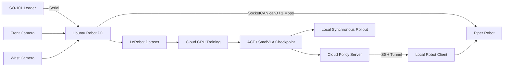

# 基于 LeRobot 的 SO-101/Piper 机械臂模仿学习与 VLA 部署

**SO-101 Teleoperation, Piper ACT Imitation Learning, Dual-Skill Orchestration and VLA Deployment**

本项目记录并工程化整理一套真实机械臂学习实践流程，覆盖 SO-101 leader 遥操作 Piper、ACT 示教数据采集与训练、双 ACT 长程任务组合、OpenVLA-LIBERO 仿真评测，以及 SmolVLA 基于 Piper 真机数据的微调和同步/异步部署。

仓库提供参数化命令封装、原创双技能状态机、安全过滤、脱敏工具、测试和文档，不重新分发 LeRobot、ACT、OpenVLA、SmolVLA、LIBERO、Piper SDK 源码，也不包含私有手册、数据集、模型权重、原始日志或设备标识。

## 已完成能力

- SO-101 leader 串口输入、Piper SocketCAN `can0`（1 Mbps）执行和 front/wrist 双相机观测。
- `lerobot-record` 数据采集、云端 ACT/SmolVLA 训练、检查点回传和 Piper 本地 rollout。
- 两个独立 ACT 策略通过 `INIT → SKILL_A → WAIT_CONFIRM → SKILL_B → DONE` 组织，任意活动阶段可进入 `ABORTED`。
- OpenVLA 在 LIBERO Spatial、Object、Goal、Long 四类 MuJoCo 套件上的统一评测入口。
- SmolVLA Base 使用 Piper LeRobot 数据微调、本地同步 rollout，以及 Policy Server—SSH 隧道—Robot Client 异步链路。
- 无机器人、无 GPU 的配置、状态机、安全过滤、超时和日志脱敏测试。

以上能力表示流程已经完成运行验证；仓库没有收到可公开核验的原始日志，因此不发布成功率、训练步数、episode 数量、GPU 型号、耗时或 checkpoint 指标。

## 系统组成与架构



`src/robot_learning/` 是本仓库原创的配置、安全与双 ACT 编排层；`scripts/` 只组装上游 CLI，并默认预览而不执行真机动作。硬件拓扑和软件边界见 [architecture](docs/architecture.md) 与 [hardware topology](docs/hardware_topology.md)。

## ACT 主流程

1. `scripts/check_robot_environment.sh` 只检查运行条件，不收集用户、网络、USB 序列号或凭据。
2. `scripts/setup_can.sh` 检查接口并预览 CAN 配置；传入 `--execute` 才修改接口。
3. `scripts/record_piper_act.sh` 从环境变量组装 Piper、SO-101 leader、双相机、任务和数据集参数。
4. `scripts/train_act_autodl.sh` 参数化训练目录、设备、步数、batch size、W&B 和保存频率；没有证据的数值不设默认值。
5. `scripts/download_act_checkpoint.sh` 通过显式 SSH 环境变量回传检查点。
6. `scripts/rollout_act_local.sh` 默认只预览；`--execute-robot` 才启动上游真机 rollout。

详见 [ACT pipeline](docs/act_pipeline.md)。

## 双 ACT 长程任务

两个 `SkillRuntime` 分别保存 policy、preprocess、postprocess、checkpoint 和任务文本。每轮开始重置两个策略；技能 A 完成后只进入人工确认态，确认后再次调用技能 B 的 `reset()`。代码不访问 `_action_queue` 等上游私有变量。

动作在唯一发送出口前检查维度、NaN/Inf、关节/夹爪绝对范围和单步变化。阶段/总任务超时、Ctrl+C、异常或无交互确认都会进入 `ABORTED`。默认 `EXECUTE_ROBOT = False`，并提供 `MockRobot` 测试。详见 [dual ACT long horizon](docs/dual_act_long_horizon.md)。

```bash
python scripts/run_dual_act.py --config configs/dual_act/dual_act.example.yaml
```

该命令仅运行 MockRobot。连接硬件需显式增加 `--hardware`；真正发送动作还需同时增加 `--execute-robot`。

## OpenVLA-LIBERO 四套件评测

`scripts/eval_openvla_libero.sh` 统一映射：

| 参数 | LIBERO 套件 |
| --- | --- |
| `spatial` | `libero_spatial` |
| `object` | `libero_object` |
| `goal` | `libero_goal` |
| `long` | `libero_10` |

脚本检查 OpenVLA、LIBERO、MuJoCo/EGL 和 checkpoint，按时间戳创建独立输出目录，并保存评测日志和视频索引。FlashAttention 不可用时可记录 SDPA fallback。这里是 LIBERO MuJoCo 仿真评测，不是 OpenVLA 的 Piper 真机部署。详见 [OpenVLA-LIBERO](docs/openvla_libero.md)。

## SmolVLA：Piper 微调与部署

- `finetune_smolvla_piper.sh`：SmolVLA Base + Piper 数据，支持独立输出目录、离线模式、resume 和 LeRobot 0.6.1 的 PEFT/LoRA 参数。未被该版本暴露的量化训练会失败关闭，不会伪造 CLI 参数。
- `rollout_smolvla_sync.sh`：模型、观测和执行均在本地，默认 dry-run。
- `serve_smolvla_policy.sh`、`open_policy_ssh_tunnel.sh`、`run_smolvla_robot_client.sh`：模型在云端加载，观测和执行在本地，通过 SSH 本地端口转发连接。

异步公网链路不被声明为安全实时控制系统；网络中断时操作人员必须能立即停止设备。详见 [SmolVLA fine-tuning](docs/smolvla_finetuning.md) 与 [async inference](docs/async_inference.md)。

## 快速开始

```bash
python -m venv .venv
source .venv/bin/activate
python -m pip install -e '.[dev]'
cp .env.example .env
make test
make validate
```

随后按目标流程安装对应上游依赖，并在本地 `.env` 中填写设备、任务、数据集和 checkpoint。`.env` 不得提交。所有脚本的第一次运行应保持预览或 dry-run。

## 测试与 CI

`make test` 和 `make validate` 不连接 Piper、不创建 can0、不下载模型、不运行 GPU 训练或 MuJoCo 大规模评测。GitHub Actions 包含 Python/Shell 语法、pytest、配置模板、secret pattern、大文件/权重/视频检查和 `git diff --check`。

## 安全边界

物理急停、空场景、现场监护、低速验收和相机一致性是前提。软件限幅无法识别桌面碰撞、卡死、线缆缠绕、人体接触或所有通信故障。本项目不具备工业安全认证、量产可靠性或无人值守运行能力。执行任何真机命令前必须阅读 [safety](docs/safety.md)。

## 上游项目与许可

运行链路依赖 LeRobot、ACT、OpenVLA、LIBERO、SmolVLA、`lerobot_robot_piper` 和 Piper SDK；它们各自遵循自己的许可证。仓库中的 MIT License 只覆盖本仓库原创的编排、安全、配置、测试和脚本封装，不会重新许可任何上游源码。已核对版本与来源见 [upstream versions](docs/upstream_versions.md) 和 [references](docs/references.md)。

