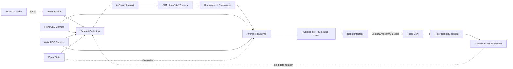

# SO-101/Piper 具身智能机器人学习数据闭环与部署工程

**Robot Data Pipeline, Policy Runtime, Dual-Skill Orchestration and Deployment Engineering**

[English README](README.en.md) · [个人贡献边界](docs/contribution_matrix.md) · [工程证据索引](docs/evidence_index.md) · [9 份原创手册](docs/manuals/README.md)

本仓库基于作者已经完成的机器人实验进行工程化复刻，覆盖 SO-101 从零搭建与遥操作、独立 SO-101 ACT、SO-101 leader 遥操作 Piper、ACT 示教数据采集与训练、双 ACT 长程任务组合、OpenVLA-LIBERO 仿真评测、SmolVLA 基于 Piper 真机数据的微调和同步/异步部署，以及 DROID 公共数据集的受控抽样与结构检查。作者完成了硬件接入、Linux 环境、遥操作、数据采集、训练/评测/部署、故障处理和 9 份原创实验手册。

episode 数量、采集频率、训练步数、checkpoint 选择、双 ACT 参数、OpenVLA 评测配置和 SmolVLA 同步/异步推理配置，均来自用户实际完成的实验记录与补充资料，不是为了展示而虚构的默认值。源实验已经完成硬件操作、训练、评测和 rollout；当前工程重构 revision 已通过离线、MockRobot 和 CI 验证，但尚未在用户硬件环境重新完成一次端到端回归。

GitHub Actions 有意运行在无机器人、无 CAN、无摄像头、无 GPU 模型和无 checkpoint 的环境中，用于验证配置、命令构造、Mock 状态机、安全门控、仓库完整性和复刻流程。硬件相关步骤由复刻者在本地安装依赖、填写主机参数并接入 SO-101、Piper、SocketCAN 和双摄像头后分级执行。

> This repository is an engineering reconstruction of completed SO-101/Piper robot experiments. Its run parameters were recorded from actual experiments, while GitHub Actions intentionally validates software reproducibility without physical hardware. The current refactored revision still requires an end-to-end replay on the target robot environment.

仓库提供参数化命令封装、双技能状态机、安全过滤、部署分级、故障分析、脱敏工具、测试和文档，并公开作者原创且已完成隐私审查的 9 份实验手册。仓库不重新分发 LeRobot、ACT、OpenVLA、SmolVLA、LIBERO、Piper SDK 源码，也不包含原始数据集、模型权重、完整视频、私有日志或设备标识。

## 工程定位

本项目突出 Robot Learning Deployment，而不包装算法创新：

- **Dataset Pipeline**：遥操作、机器人状态、双相机、任务文本、LeRobot 数据集、训练输入和证据记录形成可追踪闭环。
- **Inference Runtime**：同步 ACT/SmolVLA、双 ACT 状态机、异步 Policy Server—SSH—Robot Client 和统一动作发送边界。
- **Robot Deployment**：从无硬件 CI 到设备发现、连接验证、低速 rollout 和完整 replay 的分级部署。
- **Failure Analysis**：按环境、设备、数据、训练、checkpoint、运行时、通信和安全出口定位故障。

仓库没有自研 ACT/OpenVLA/SmolVLA，也没有修改 Transformer、视觉骨干、loss 或训练算法。OpenVLA 仅用于 LIBERO 仿真评测，不声称部署到 Piper 真机。

## 工程能力

- SO-101 follower/leader 的环境搭建、串口、校准、遥操作与 front/side 双相机 ACT 闭环。
- SO-101 leader 串口输入、Piper SocketCAN can0（1 Mbps）执行和 front/wrist 双相机观测。
- `lerobot-record` 数据采集、云端 ACT/SmolVLA 训练、检查点回传和 Piper 本地 rollout。
- 两个独立 ACT 策略通过 `INIT → SKILL_A → WAIT_CONFIRM → SKILL_B → DONE` 组织，任意活动阶段可进入 `ABORTED`。
- OpenVLA 在 LIBERO Spatial、Object、Goal、Long 四类 MuJoCo 套件上的统一评测入口。
- SmolVLA Base 使用 Piper LeRobot 数据微调、本地同步 rollout，以及 Policy Server—SSH 隧道—Robot Client 异步链路。
- DROID 公共数据的选择性下载、断点恢复、磁盘保护、HDF5 与多视角视频检查。
- 无机器人、无 GPU 的配置、状态机、安全过滤、超时和日志脱敏测试。

上述硬件、训练、评测和部署能力来自已完成的源实验；仓库中的对应参数标记为 `experiment_recorded`。当前 revision 的声明范围是配置一致性、命令预演、Mock 行为和 CI，而不是一次新的真机回归。资料未提供可随仓库公开核验的成功率、loss、延迟或耗时证据，因此不自行补写这些指标。完整区分见 [reproduction status](docs/reproduction_status.md) 和 [measured experiment baseline](docs/measured_experiment_baseline.md)。

## 系统组成与架构



这条主链明确展示完整学习闭环：**SO-101 Leader → Teleoperation → Dataset Collection → ACT/SmolVLA Training → Checkpoint → Inference Runtime → Robot Interface → Piper CAN → Robot Execution → 新一轮数据与证据**。OpenVLA-LIBERO 是旁路仿真评测，不进入 Piper 真机执行链。

| 层级 | 本仓库中的落点 | 可审查边界 |
| --- | --- | --- |
| 示教与数据 | `record_piper_act.sh`、LeRobot dataset、front/wrist 观测 | 设备路径、任务、FPS、观测键和动作维度保持一致 |
| 训练与模型 | ACT/SmolVLA wrappers、checkpoint 目录、对应 processors | 调用上游训练与加载能力，不修改模型架构或算法 |
| 推理与编排 | 同步 rollout、双 ACT 状态机、异步 Policy Server/Robot Client | 两技能分别加载；`WAIT_CONFIRM` 阻断自动长程串联 |
| 动作与硬件 | `ActionFilter`、执行双门控、Piper adapter、SocketCAN | 候选动作先过滤；只有显式授权才能到达 CAN 发送出口 |
| 证据与迭代 | 脱敏日志、结果模板、dataset feedback | 无证据不发布指标；CI/Mock 不记作真机 replay |

`src/robot_learning/` 是本仓库原创的配置、安全与双 ACT 编排层；`scripts/` 只组装上游 CLI，并默认预览而不执行真机动作。硬件拓扑、接口和软件边界见 [architecture](docs/architecture.md)、[hardware topology](docs/hardware_topology.md) 与 [hardware interfaces](docs/hardware_interfaces.md)。

## 工程文档导航

| 文档 | 解决的问题 |
| --- | --- |
| [Project Story](docs/project_story.md) | 作者完成了什么，以及 Hardware → Linux → Data → Policy → Deployment 如何贯通 |
| [Contribution Matrix](docs/contribution_matrix.md) | 个人工作、上游能力和公开证据如何区分 |
| [Evidence Index](docs/evidence_index.md) | 每类证据能支持与不能支持哪些声明 |
| [Original Manuals](docs/manuals/README.md) | 9 份原创实验手册、许可、哈希和发布审查 |
| [SO-101 Setup](docs/so101_setup.md) | SO-101 环境、校准、遥操作和分级接入 |
| [SO-101 ACT](docs/so101_act_pipeline.md) | 独立 SO-101 ACT 数据、训练和 rollout 链 |
| [DROID Engineering](docs/droid_dataset_engineering.md) | 公共数据子集下载、检查与声明边界 |
| [Dataset Pipeline](docs/dataset_pipeline.md) | 数据如何从遥操作与观测进入训练，并回到部署证据闭环 |
| [Inference Runtime](docs/inference_runtime.md) | 同步、双 ACT、异步和仿真运行时如何划分 |
| [Robot Deployment](docs/robot_deployment.md) | 如何按 Level 0–6 将软件安全地接入目标硬件 |
| [Failure Analysis](docs/failure_analysis.md) | 如何按层定位数据、checkpoint、通信和运行时故障 |
| [Hardware Interfaces](docs/hardware_interfaces.md) | SO-101、USB 相机、Robot PC、Policy Runtime 与 Piper CAN 如何连接 |
| [Dual ACT Design](docs/dual_act_design.md) | 两 checkpoint、两套 processors、状态机与人工交接如何隔离失败传播 |
| [Deployment Checklist](docs/deployment_checklist.md) | 部署前、部署中、部署后的逐项验收与回滚检查 |
| [Reproduction Status](docs/reproduction_status.md) | 历史源实验与当前 revision 验证状态如何区分 |
| [Safety](docs/safety.md) | 动作门控、监督要求和物理安全边界 |

## Reproducibility

```text
Reproducibility
├── Dataset Pipeline       docs/dataset_pipeline.md
├── Deployment Checklist  docs/deployment_checklist.md
├── Results Templates      results/README.md
└── Environment Check      scripts/environment_check.py
```

- [Dataset Pipeline](docs/dataset_pipeline.md) 固化示教、观测、数据集、训练输入和证据回流关系。
- [Deployment Checklist](docs/deployment_checklist.md) 给出部署前、中、后的分级检查与回滚边界。
- [Results Templates](results/README.md) 为 ACT rollout、双 ACT、部署和排障提供统一的可审查记录格式。
- [Environment Check](scripts/environment_check.py) 只读检查软件依赖与部署前置项，不连接机器人或发送动作。

```bash
bash scripts/setup_robot_software.sh
bash scripts/setup_robot_software.sh --execute
python scripts/environment_check.py --profile software --strict
python scripts/environment_check.py --profile deployment --json
```

软件安装脚本默认只预览；`--execute` 才在 Ubuntu/Linux 创建 `.venv`、安装 [pinned Robot PC runtime](requirements/robot-runtime.txt) 和本仓库。`--profile software` 检查 Python、distribution 与 YAML 语义；`--profile deployment` 额外读取本地 `.env` 并检查 checkpoint、Camera、CAN 的存在性。`--strict` 只要求所选范围内的自动化检查完成，不证明 checkpoint/processors 兼容、Camera 角色/画面、CAN bitrate/流量或真机任务成功。部署证据在完成这些人工检查和实际记录前始终是 `NOT_VERIFIED`。

## SO-101 基础与独立 ACT

SO-101 路线先完成 follower/leader 的端口识别、校准和遥操作，再以 front/side 双相机采集 50 条、30 FPS 的 ACT 示教数据，训练并回传 020000 checkpoint。`teleoperate_so101.sh`、`record_so101_act.sh` 和 `rollout_so101_act_local.sh` 均默认 dry-run，只有 `--execute-robot` 才调用真实机器人 CLI。详见 [SO-101 setup](docs/so101_setup.md) 与 [SO-101 ACT pipeline](docs/so101_act_pipeline.md)。

## DROID 数据工程附录

DROID 是上游公共数据集，不是作者自采数据。作者完成了受控抽样、可恢复下载、磁盘保护以及本地 HDF5/视频检查；公开仓库只保留下载器和脱敏结构摘要，不发布 raw episode。详见 [DROID dataset engineering](docs/droid_dataset_engineering.md)。
## ACT 主流程

1. `scripts/check_robot_environment.sh` 只检查运行条件，不收集用户、网络、USB 序列号或凭据。
2. `scripts/setup_can.sh` 检查接口并预览 CAN 配置；传入 `--execute` 才修改接口。
3. `scripts/record_piper_act.sh` 从环境变量组装 Piper、SO-101 leader、双相机、任务和数据集参数。
4. `scripts/train_act_autodl.sh` 参数化训练目录、设备、步数、batch size、W&B 和保存频率；20,000-step checkpoint 是源实验记录的选择，未明确记录的 ACT batch/save 参数继续交给对应 LeRobot 版本。
5. `scripts/download_act_checkpoint.sh` 通过显式 SSH 环境变量回传检查点。
6. `scripts/rollout_act_local.sh` 默认只预览；`--execute-robot` 才启动上游真机 rollout。

详见 [ACT pipeline](docs/act_pipeline.md)。

## 双 ACT 长程任务

两个 `SkillRuntime` 分别保存 policy、preprocess、postprocess、checkpoint 和任务文本。每轮开始重置两个策略；技能 A 完成后只进入人工确认态，确认后再次调用技能 B 的 `reset()`。代码不访问 `_action_queue` 等上游私有变量。设计动机、组件与权衡见 [dual ACT design](docs/dual_act_design.md)，运行细节见 [dual ACT long horizon](docs/dual_act_long_horizon.md)。

动作在唯一发送出口前检查维度、NaN/Inf、关节/夹爪绝对范围和单步变化；第一次非法动作立即进入 `ABORTED`，不会被忽略或累计。默认 `EXECUTE_ROBOT = False`，并提供 `MockRobot` 测试。详见 [dual ACT long horizon](docs/dual_act_long_horizon.md)。

```bash
python scripts/run_dual_act.py \
  --config configs/dual_act/dual_act.example.yaml \
  --auto-confirm-mock
```

该命令仅运行 MockRobot。连接硬件需显式增加 `--hardware`；真正发送动作必须同时满足配置 `allow_robot_execution=true` 和命令行 `--execute-robot`。任一授权缺失都不会发送动作，且配置拒绝发生在 adapter 连接和模型加载之前。

`use_degrees=false` 表示关节使用约 `[-100, 100]` 的归一化位置、夹爪使用 `[0, 100]` 的归一化范围，不是弧度。双 ACT 的 `[-95, 95]` 是手册提供的保守归一化动作边界，不是机械臂硬件角度限位。

## OpenVLA-LIBERO 四套件评测

`scripts/eval_openvla_libero.sh` 统一映射：

| 参数 | LIBERO 套件 |
| --- | --- |
| `spatial` | `libero_spatial` |
| `object` | `libero_object` |
| `goal` | `libero_goal` |
| `long` | `libero_10` |

执行模式检查 OpenVLA、LIBERO、MuJoCo/EGL 和 checkpoint，并在 wrapper 的时间戳目录中捕获控制台日志。当前没有可核验的 OpenVLA 源码 checkout，因此 wrapper 只传递手册确认的四个上游参数，不声明 attention backend、fallback 或上游视频目录；上游产物位置由实际安装 revision 决定。这里是 LIBERO MuJoCo 仿真评测，不是 OpenVLA 的 Piper 真机部署。详见 [OpenVLA-LIBERO](docs/openvla_libero.md)。

## SmolVLA：Piper 微调与部署

- `finetune_smolvla_piper.sh`：SmolVLA Base + Piper 数据，支持独立输出目录、离线模式、resume 和 LeRobot 0.6.1 的 PEFT/LoRA 参数。未被该版本暴露的量化训练会失败关闭，不会伪造 CLI 参数。
- `rollout_smolvla_sync.sh`：模型、观测和执行均在本地，默认 dry-run。
- `serve_smolvla_policy.sh`、`open_policy_ssh_tunnel.sh`、`run_smolvla_robot_client.sh`：模型在云端加载，观测和执行在本地，通过 SSH 本地端口转发连接。

异步公网链路不被声明为安全实时控制系统；网络中断时操作人员必须能立即停止设备。详见 [SmolVLA fine-tuning](docs/smolvla_finetuning.md) 与 [async inference](docs/async_inference.md)。

## 面向复刻者的开始流程

```bash
git clone https://github.com/JKyao-333/lerobot-so101-piper-vla.git
cd lerobot-so101-piper-vla
bash scripts/setup_robot_software.sh
bash scripts/setup_robot_software.sh --execute
source .venv/bin/activate
make validate
make workflow-dry-run
cp .env.example .env
python scripts/environment_check.py --profile software --strict
```

随后按顺序完成：

1. 检查 [runtime source pins](requirements/README.md) 和 [upstream versions](docs/upstream_versions.md)，执行软件安装脚本并保存实际解析版本。
2. 运行 `python scripts/validate_experiment_baseline.py --json`。
3. 在本地 `.env` 中替换设备端口、CAN、相机、任务、数据集、checkpoint、网络、云端目录和 GPU 参数。
4. 接入 SO-101、Piper、SocketCAN、front/wrist 相机及物理停止装置。
5. 运行环境检查并确认设备发现结果。
6. 先预览、再由现场操作员配置 CAN。
7. 分别验证遥操作、数据采集和每个 checkpoint，不直接从组合任务开始。
8. 保持动作发送关闭，先验证机器人连接、观测键和动作维度。
9. 清空工作区并采用短时、低速、有人监护的单技能 rollout。
10. 最后才启用双技能或完整实验 replay，并创建新的结果记录。

软件环境、配置模板、工作流、Mock 验证和安全门控已经准备完成；复刻者仍需安装依赖、填写本机设备/路径参数并接入对应硬件。完整步骤见 [hardware onboarding](docs/hardware_onboarding.md)。`.env` 不得提交。

## 测试与 CI

`make test` 和 `make validate` 不连接 Piper、不创建 can0、不下载模型、不运行 GPU 训练或 MuJoCo 大规模评测。GitHub Actions 包含 Python/Shell 语法、pytest、实验 provenance 与配置投影、secret pattern、大文件/权重/视频检查、`git diff --check`，并逐个执行所有 shell workflow 的无硬件预演。CI 验证软件可复刻性，不替代当前 commit 的硬件 replay。

## 安全边界

物理急停、空场景、现场监护、低速验收和相机一致性是前提。软件限幅无法识别桌面碰撞、卡死、线缆缠绕、人体接触或所有通信故障。本项目是研究与教学复刻工程，不替代经过认证的工业控制系统，也不支持脱离现场操作员运行。执行任何真机命令前必须阅读 [safety](docs/safety.md)。

## 上游项目与许可

运行链路依赖 LeRobot、ACT、OpenVLA、LIBERO、SmolVLA、`lerobot_robot_piper`、Piper SDK 和 DROID；它们各自遵循自己的许可证。MIT License 覆盖本仓库原创代码，作者原创手册及原创文档/图稿采用 CC BY 4.0；两者都不会重新许可上游材料。详见 [credits and provenance](docs/credits_and_provenance.md)、[upstream versions](docs/upstream_versions.md) 和 [references](docs/references.md)。
