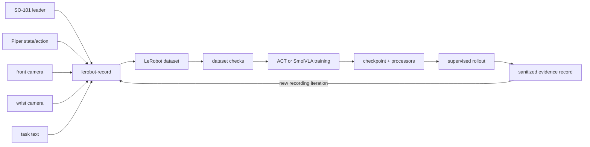

# Dataset Pipeline

本项目的数据链路目标是把 SO-101 leader 遥操作、Piper 状态、双相机观测和任务文本组织为可追踪的 LeRobot 数据集，再将训练产物送回受监督的推理与部署流程。仓库工程化的是数据闭环和命令边界，不修改 ACT、OpenVLA 或 SmolVLA 的算法结构。

## 数据闭环

原始数据、模型权重和未脱敏日志不进入 Git。仓库保存配置、命令封装、验证规则和结果模板，使采集、训练、推理和故障复盘使用同一组任务、相机、动作和 checkpoint 语义。

## 已记录的实验基线

| 项目 | 基线值 | 语义 |
| --- | --- | --- |
| 示教数量 | 约 50 episodes | 已完成源实验的记录参数 |
| 单 episode 时长 | 30 s | 数据采集窗口 |
| reset 时长 | 15 s | episode 间人工复位窗口 |
| 数据集 FPS | 15 | 记录/策略链路频率 |
| 相机采集配置 | front/wrist，640×480，30 FPS | 相机输入配置；不等同于数据集 FPS |
| 编码 | streaming，2 threads，CRF 20 | 视频编码配置 |
| ACT checkpoint | 20,000 steps | 源实验采用的 checkpoint 选择 |
| SmolVLA | batch 4，workers 4，20,000 steps | 源实验训练参数 |

这些值来自 `configs/reference/measured_experiment_baseline.yaml`。串口、相机编号、CAN 名称、数据集路径、GPU 和 checkpoint 路径虽然在源实验中真实使用过，但在新主机上仍属于环境相关字段。

## 数据契约

- 任务文本必须与数据集和 checkpoint 匹配；当前基线任务为 `Put the banana on the plate.`。
- 相机角色固定为 `front` 和 `wrist`。相机能打开不代表角色、朝向或视野正确。
- Piper 使用 `use_degrees=false`：六个关节为归一化位置，夹爪为 `[0, 100]` 归一化范围，不是弧度。
- 双 ACT 和 ACT 动作维度为 7；checkpoint 必须携带各自对应的 preprocess/postprocess 配置。
- 数据集 `repo_id`、本地 `root` 和 `push_to_hub=false` 分开配置，避免把本地实验数据误上传。

## 执行入口

1. 复制 `.env.example` 为本地 `.env`，逐项确认设备和路径。
2. 运行 `scripts/check_robot_environment.sh`，只做环境和设备发现。
3. 预览 `scripts/record_piper_act.sh` 生成的 `lerobot-record` 命令。
4. 现场确认后，显式使用脚本的 `--execute` 进入采集。
5. 使用 `scripts/train_act_autodl.sh` 或 `scripts/finetune_smolvla_piper.sh` 预览训练命令。
6. 通过 `scripts/download_act_checkpoint.sh` 回传 checkpoint，并保留源 commit、配置和脱敏日志。
7. 在启用 rollout 前，分别检查数据集、相机键、动作维度、processor 和 checkpoint 身份。

完整无硬件命令链可用 `make workflow-dry-run` 验证。

## 采集质量门

- 每个 episode 开始前确认物体初始位置、相机固定状态和任务文本。
- 检查帧数、时长、图像尺寸、相机键、动作维度和非有限值。
- 检查 reset 阶段没有被误记录为有效任务动作。
- 抽查 front/wrist 是否对调、遮挡、模糊、掉帧或曝光异常。
- 训练前保留数据版本和配置摘要；不要用覆盖旧目录的方式“续跑”。
- 发现抖动或任务漂移时先停止部署，回到数据、任务文本、相机和动作单位检查，不先扩大安全边界。

## 证据边界

配置一致、命令可预览和数据结构正确，不等于模型性能已达到某个数值。成功率、loss、训练耗时和延迟只有在结果记录同时包含 evidence path、日期、episodes/tasks 和 source record 时才能发布；缺少证据时保持空白。
