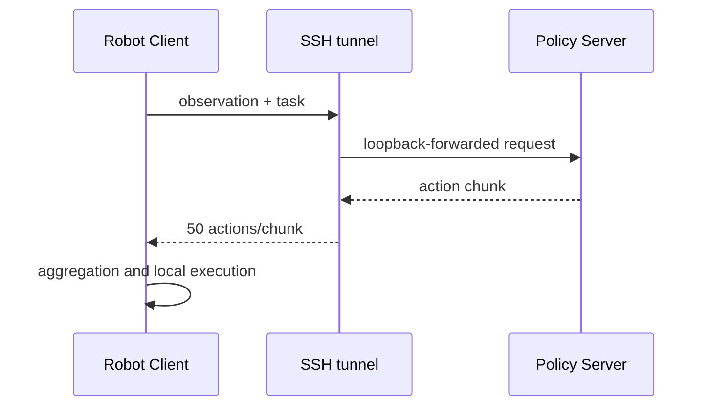

# Inference Runtime

推理运行时负责把观测、任务文本、checkpoint processors、策略动作、安全门控和机器人发送出口连接起来。仓库提供运行时编排与安全边界，不声称自研 ACT、OpenVLA、SmolVLA 或修改 Transformer。

## 运行模式

| 模式 | 策略位置 | 观测/执行位置 | 入口 | 适用范围 |
| --- | --- | --- | --- | --- |
| ACT 同步 | 本地机器人主机 | 本地 | `scripts/rollout_act_local.sh` | 单技能 Piper rollout |
| 双 ACT | 本地机器人主机 | 本地 | `scripts/run_dual_act.py` | 两个独立 ACT checkpoint 的人工交接任务 |
| SmolVLA 同步 | 本地机器人主机 | 本地 | `scripts/rollout_smolvla_sync.sh` | 本地模型与机器人闭环 |
| SmolVLA 异步 | 云端 Policy Server | 本地 Robot Client | server、SSH tunnel、client 三脚本 | 算力与机器人分离 |
| OpenVLA-LIBERO | 仿真主机 | LIBERO/MuJoCo | `scripts/eval_openvla_libero.sh` | 四套件仿真评测，不是 Piper 真机运行时 |

## 同步链路

```text
camera/robot observation
  -> checkpoint-specific preprocess
  -> policy.select_action()
  -> checkpoint-specific postprocess
  -> dimension/finite/bounds/delta checks
  -> explicit execution gate
  -> Piper command
```

双 ACT 通过 `SkillRuntime` 隔离每个 checkpoint 的 policy、preprocess 和 postprocess，状态机为：

```text
INIT -> SKILL_A -> WAIT_CONFIRM -> SKILL_B -> DONE
  \---------------- failure/timeout ----------------> ABORTED
```

进入 Skill B 必须由现场人员检查后确认。Enter/y/yes/next 继续；n/no/q/quit/abort 和未知输入均中止。

## 动作发送边界

- 默认不发送动作。
- 双 ACT 必须同时设置 `allow_robot_execution=true` 和命令行 `--execute-robot`。
- Mock 模式不能发送真实动作，`--auto-confirm-mock` 与 `--hardware` 互斥。
- 动作过滤拒绝错误维度、非数值、NaN/Inf，并应用绝对范围和单步变化限制。
- 首次非法动作立即进入 `ABORTED`，不会累计或忽略。
- best-effort hold 优先使用完整的当前测量姿态；测量不可用时才回退到最后一次安全命令。它不是物理停止装置。

## 异步链路



源实验配置为 15 Hz、50 actions/chunk、threshold `0.5` 和 `weighted_average`。`50 / 15 = 3.333 s` 只是动作块名义覆盖时间，不是实测网络延迟或安全停止时间。

锁定的 LeRobot Robot Client 没有额外客户端 timeout 参数。Policy Server 的 `obs_queue_timeout` 只控制服务端等待 observation 的时间，不能当作机器人停止保证。隧道中断、服务异常、队列耗尽或陈旧观测需要现场操作员介入。

## 生命周期和清理

- adapter 创建、Piper/camera connect、dataset feature 构造和 Skill A/B 加载都在清理边界内。
- 初始化失败会尝试 hold/disconnect；清理异常写入日志，但不覆盖原始错误。
- 相机断开不会单独阻止控制通道尝试 hold。
- 对 Piper 私有 `_iface` 的兼容访问仅集中于 pinned adapter shim，并绑定已记录的上游 commit。

## 可观测性

每次实际运行至少记录：repository commit、上游版本、resolved command、模式、checkpoint、任务、相机角色、动作频率、是否启用执行、退出状态和脱敏日志。不要把 dry-run、Mock 或 CI 输出记为真机性能结果。
