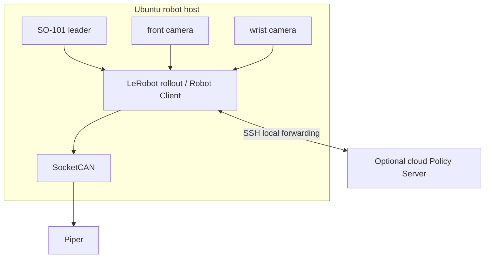

# Robot Deployment

本项目的部署目标是让复刻者在安装依赖、填写本机参数并接入硬件后，按可回退的阶段把训练产物部署到 Piper。部署不是单个启动命令，而是环境、设备、数据契约、checkpoint、安全门控和证据记录的组合流程。

## 部署拓扑

OpenVLA 在本仓库只用于 LIBERO/MuJoCo 评测，不进入上图的 Piper 部署链路。

## 部署前提

- Ubuntu robot PC、SO-101 leader、Piper、SocketCAN、front/wrist 相机。
- 可立即触达的物理停止装置和现场操作员。
- 与 `docs/upstream_versions.md` 对齐的 LeRobot、Piper adapter 和 SDK。
- 已验证的数据集、checkpoint、preprocess/postprocess 和任务文本。
- 本地 `.env` 中已替换串口、CAN、相机、路径、GPU 和网络占位值。

## 分级部署

| Level | 目标 | 命令/动作 | 通过条件 |
| --- | --- | --- | --- |
| 0 | 仓库验证 | `make validate` | 配置、测试、扫描通过 |
| 1 | 命令预演 | `make workflow-dry-run` | 所有 wrapper 不接触硬件完成预览 |
| 2 | 设备发现 | `scripts/check_robot_environment.sh` | 串口、CAN、video、依赖和存储可解释 |
| 3 | 通信验证 | 先预览再配置 `scripts/setup_can.sh` | bitrate、CAN 状态和相机角色确认 |
| 4 | 连接但不执行 | 双 ACT `--hardware`，不带 `--execute-robot` | observation、feature、checkpoint 加载成功 |
| 5 | 低速监督 rollout | 单技能、短时、清空场景 | 方向、单位、相机、停止机制通过现场检查 |
| 6 | 完整 replay | ACT/双 ACT/SmolVLA 目标流程 | 独立结果记录和证据齐全 |

不得跳过 Level 4 直接启用组合动作。每次升级 Level 前都应能恢复到断电或官方停止机制控制下的安全状态。

## 同步部署

1. 确认本地计算资源能加载 checkpoint。
2. 预览 `scripts/rollout_act_local.sh` 或 `scripts/rollout_smolvla_sync.sh`。
3. 核对 front/wrist 键、图像尺寸、动作维度、任务文本和 `use_degrees=false`。
4. 先运行一个短 episode，再逐步增加时长；不要一次启动多个无人监督 episode。

同步模式减少网络依赖，但仍可能受到 GPU 内存、推理耗时、camera/CAN 和 checkpoint 不兼容影响。

## 异步部署

1. 云端预览并启动 `scripts/serve_smolvla_policy.sh`，只绑定 loopback。
2. 本地预览并建立 `scripts/open_policy_ssh_tunnel.sh`。
3. 保持动作发送关闭，预览 `scripts/run_smolvla_robot_client.sh`。
4. 核对 server URL、端口、checkpoint、policy/client device、camera1/camera2 和 15 Hz 控制配置。
5. 现场操作员准备停止后，才启用 Robot Client 的动作执行。

SSH 链路不是确定性机器人现场总线。任何 tunnel/server 异常都应终止本次部署尝试并记录日志，不应自动扩大 chunk 或继续使用陈旧动作。

## 发布与回退

- 数据集和 checkpoint 使用不可变目录或明确版本，不覆盖源实验记录。
- 每次部署记录 repository commit、dirty 状态、上游版本和 resolved config。
- 新 checkpoint 先通过单技能和空场景验证，再进入双技能状态机。
- 发生异常时停止新动作、尝试 best-effort hold，并使用物理停止机制作为最终控制手段。
- 当前重构 commit 尚未完成端到端真机 replay；CI 通过不改变这一状态。
